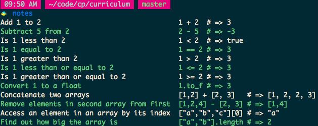
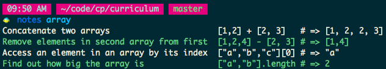
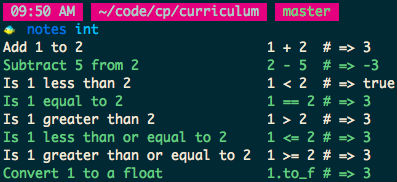
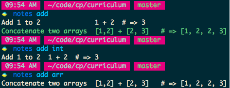

Notes
-----

We often take notes, eg I have a cheatsheets directory where I store ideas.
But if it's difficult to get to those notes, I probably won't look at them.

Lets make that information easily accessible by building a program whose job
is to store the notes and let us query them easily.
We'll name the program `notes`

I've added some integer and array notes to mine, and when I run it it shows me all the notes:



If I run with the argument "array", it will only show me the array notes.



If I run with the argument "int" it will only show me the integer notes.



If I run with the argument "add", it shows me notes about addition,
"add int" shows me notes about addition of integers, and "add arr" shows
me notes about adding arrays.



Notes are added into the program by editing its source code, ie

```sh
# in fish
$ vim (which notes)

# in bash
$ vim `which notes`
```


Iterations
----------

To complete this project, you need to iteratively add small bits of functionality
to a working program. You will only get credit for completed iterations.


**All iterations must be test driven, and in your git history**

(note that I've literally provided numerous examples that you can use as an acceptance test,
and the [building a gem](https://github.com/turingschool/lesson_plans/tree/master/electives/building-a-gem)
tutorial shows you how to test a program from the outside)


### 1. It displays all notes by default

Start with an acceptance test (ie when you change everything about the implementation, it still passes).
It should execute the program and look at the program's standard output and exit status.

Add a few notes to the program, and when you run `notes`, it should print them.
Don't make this step hard, you can literally pass it with a big puts statement.

```
$ ruby bin/notes
Add 1 to 2    1 + 2  # => 3
Subtract 5 from 2    2 - 5  # => -3
Is 1 less than 2    1 < 2  # => true
Is 1 equal to 2    1 == 2 # => 3
Is 1 greater than 2    1 > 2  # => 3
Is 1 less than or equal to 2    1 <= 2 # => 3
Is 1 greater than or equal to 2    1 >= 2 # => 3
Convert 1 to a float    1.to_f # => 3
Concatenate two arrays    [1,2] + [2, 3]   # => [1, 2, 2, 3]
Remove elements in second array from first    [1,2,4] - [2, 3] # => [1,4]
Access an element in an array by its index    ["a","b","c"][0] # => "a"
Find out how big the array is    ["a","b"].length # => 2
```


### 2. It can be run from anywhere

Same as the previous version, but instead of running it with `$ ruby bin/notes`,
you run it with `$ notes`, and it works from anywhere on your computer.

```
$ notes
Add 1 to 2    1 + 2  # => 3
Subtract 5 from 2    2 - 5  # => -3
Is 1 less than 2    1 < 2  # => true
Is 1 equal to 2    1 == 2 # => 3
Is 1 greater than 2    1 > 2  # => 3
Is 1 less than or equal to 2    1 <= 2 # => 3
Is 1 greater than or equal to 2    1 >= 2 # => 3
Convert 1 to a float    1.to_f # => 3
Concatenate two arrays    [1,2] + [2, 3]   # => [1, 2, 2, 3]
Remove elements in second array from first    [1,2,4] - [2, 3] # => [1,4]
Access an element in an array by its index    ["a","b","c"][0] # => "a"
Find out how big the array is    ["a","b"].length # => 2
```


### 3. Select notes whose description matches an argument from the command line

We want to be able to select only the relevant notes.
When I pass a single command-line argument, it should not show
me any notes whose description doesn't match the argument.

```
$ notes
Add 1 to 2    1 + 2  # => 3
Find out how big the array is    ["a","b"].length # => 2

$ notes Add
Add 1 to 2    1 + 2  # => 3

$ notes big
Find out how big the array is    ["a","b"].length # => 2
```


### 4. Select notes whose example matches an argument from the command line

```
$ notes
Add 1 to 2    1 + 2  # => 3
Find out how big the array is    ["a","b"].length # => 2

$ notes length
Find out how big the array is    ["a","b"].length # => 2
```


### 5. Matching is case insensitive

```
$ notes
Add 1 to 2    1 + 2  # => 3
Find out how big the array is    ["a","b"].length # => 2

$ notes ADD
Add 1 to 2    1 + 2  # => 3

$ notes add
Add 1 to 2    1 + 2  # => 3
```


### 6. It treats multiple arguments as successive filters

```
$ notes
Add 1 to 2    1 + 2  # => 3
Find out how big the array is    ["a","b"].length # => 2
Add two arrays    [1,2] + [2, 3]   # => [1, 2, 2, 3]

$ notes array
Find out how big the array is    ["a","b"].length # => 2
Add two arrays    [1,2] + [2, 3]   # => [1, 2, 2, 3]

$ notes add
Add 1 to 2    1 + 2  # => 3
Add two arrays    [1,2] + [2, 3]   # => [1, 2, 2, 3]

$ notes array add
Add two arrays    [1,2] + [2, 3]   # => [1, 2, 2, 3]
```


### 7. It allows me to search by hidden information

In this example, the first note can be searched by "add",
but I keep trying to find it with "plus".
And when I search for "integer", I should be able to see all my results!

When I enter the word in the program,
I want to be able to tell it that the first note should
be able to match "plus" and "integer", as well.

This allows me to run the program like this:

```
$ notes
Add 1 to 2    1 + 2  # => 3
Subtract 2 from 1    1 - 2  # => 3
Concatenate two arrays    [1,2] + [2, 3] # => [1, 2, 2, 3]

$ notes plus
Add 1 to 2    1 + 2  # => 3
Concatenate two arrays    [1,2] + [2, 3] # => [1, 2, 2, 3]

$ notes integer
Add 1 to 2    1 + 2  # => 3
Subtract 2 from 1    1 - 2  # => 3
```


### 8. Passing `-h` prints a description

```
$ notes -h
Usage: notes [filter1] [filter2] [...]

Notes that are accessible from the command line.
```


### 9. Line the values up

```
$ notes
Add 1 to 2              1 + 2  # => 3
Subtract 2 from 1       1 - 2  # => 3
Concatenate two arrays  [1,2] + [2, 3] # => [1, 2, 2, 3]
```


Extensions
----------

### Allow examples to have multiple lines

```
$ notes array
Concatenate two arrays         [1,2] + [2, 3]   # => [1, 2, 2, 3]
Append an item to an array     a = [1]
                               a << 2
                               a # => [1, 2]
Find out how big the array is  ["a","b"].length # => 2
```


### Print every other line coloured


You can print colour with:

```ruby
puts "normal \e[30mblack\e[0m normal"
puts "normal \e[31mred\e[0m normal"
puts "normal \e[32mgreen\e[0m normal"
puts "normal \e[33myellow\e[0m normal"
puts "normal \e[34mblue\e[0m normal"
puts "normal \e[35mmagenta\e[0m normal"
puts "normal \e[36mcyan\e[0m normal"
puts "normal \e[37mwhite\e[0m normal"
```


Evaluation Rubric
-----------------

Coming Soon!

