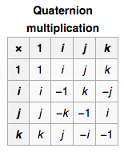

The Power and Danger of Abstractions
====================================

Purpose
-------

* Understand what abstractions are
* Understand why the are so important so that we can appreciate them
* Understand their drawbacks so that we don't trust them too much

What is an abstraction
----------------------

An abstraction is an idea that you can work with, independently of its details.
The opposite of "abstract" is "concrete", when you introduce details to aid
in understanding how the idea maps to something you are familiar with.

A concrete example of an abstraction is a name.
When you name a thing, you make it abstract.
"Instructor" instead of "Josh" or "Andrea'.
"Josh" instead of "the person speaking to me".
"Code Platoon" instead of "my school".
"School" instead of "the I'm learning".

Notice that to remove the name, we have to introduce the qualities that the name abstracs.

When you remove details, you make something abstract.
When you add details, you make something concrete.

Why are they so powerful?
-------------------------

Abstractions let you think quickly and generally.
"We're going to a concert, do you want to come?",
I immediately know many things about the event.

I've, ideally, stripped the idea down to its core parts,
and given a name to those core parts. Abstractions allow you to think
quickly and holistically.

Once you abstract addition into multiplication, you can say
`2*3` is `6`. But without it, you're relegated to performing all of the steps.
`2+2+2` is `6`. And further `3+3` is `6`. Without the abstraction of
multiplication, I wouldn't necessarily know that `2+2+2` is the same as `3+3`,
but once we introduce the abstraction, we can talk about ideas like
commutativity, which allow us to immediately recognize that `2*3` is the same as `3*2`

Abstractions allow for the emergece of properties which do not exist in the details.
If you can only turn left, you can introduce the abstraction of turning right
by turning left three times. Without the abstraction, you cannot turn right,
but with the abstraction, you can.

Why are they so dangerous?
--------------------------

Once you have an abstraction, you are divorced from potentially relevant details.
Those details may be relevant. In the example of turning right by turning left three times,
there may be a cost to turning left three times. Perhaps you have a finite
amount of angular momentum to spend, and you wind up dizzy quickly when
turning right, but not left. Perhaps it takes time to turn left, and you
take longer to arrive at your destination. You don't see this from the abstraction.

Abstractions also allow for equivocation (the association of multiple meanings to a word).
We saw that `2*3` is `3*2`, but in math, they've equivocally used multiplication for other
domains, such as the imaginary numbers and matrices, where this is not true.
`ij = k`, but `ji = -k`!

Words like "Democrat" and "Republican" boil a massive number of complex ideas
down into a single word. I'll posit that it's impossible for sucha word to reliably
express a person's beliefs.
