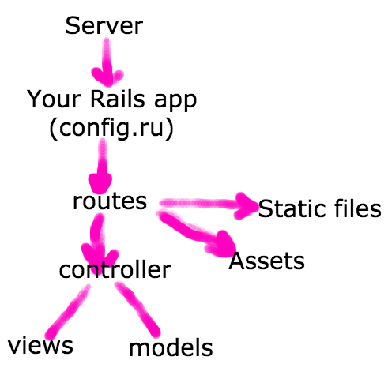

How Rails Works
===============

What is Ruby on Rails?
----------------------

Ruby on Rails is a web development "framework".
That just means it's a bunch of code and conventions to allow you to develop web apps rapidly.

Rails is a rack application, so you hook it up to a server,
which will invoke its `#call` method, which takes an `env` hash of a parsed HTTP request,
and returns an array with a status code, response headers, and body lines.


Why
---

If you got very far in your notes web app, you probably started pulling out
common functionality into methods that were generally useful, regardless
of what path or method you were hitting. This is what Rails is, a set of methods,
classes, and conventions that are generally useful to a web application.

You don't have to write a method to do a redirect, Rails has already made one for you.
You don't have to write a bunch of code to choose how to handle your request,
Rails has conventions around how to do this stuff, already.

Where to get more in-depth info
-------------------------------

* The most useful overiew of topics within Rails are the
  [Guides](http://guides.rubyonrails.org/). These are
  community maintained, cover almost every topic with a good
  high-level overview, as well as common situations, and in-depth
  exploration where necessary.
* [API docs](http://api.rubyonrails.org/) to see the docs
  for a given method or class, or what options does some method takes.
* Rails [github repo](https://github.com/rails/rails)
  to see its source code, issues, pull requests, etc.

Installing Rails
----------------

The usual way:

```
$ gem install rails
```


Generating a Rails app
----------------------

Rails comes with an executable.

```
$ rails new NAME-OF-APP
```

Rails ships with some things that I've only seen cause problems:

* **Spring**'s job is to make things go faster by caching your app in memory.
* **Turbolinks**'s job is to allow you to use JavaScript to make requests for partial updates of the page content.

I'd rather we just not hit the issues tehse can cause,
so lets turn them off when we generate our app.
You can also just delete them, but this is simpler.

```
$ rails new NAME-OF-APP --skip-spring --skip-turbolinks
```

Watch the output, and see what you can infer about what it's done.


Rails structure
---------------

Rails is too big to understand how everything works,
we need to build a foundation of high level
ideas about what kinds of things are going to be in Rails,
where they are, what they do.

Our goal is not to know how things work, but to gain insight into what Rails does,
and where it does it.

Break into groups of 3 and take 45 minutes to look around.
What files do you see?
What folders?
Can you make predictions about what you're going to see in them?
What's in that config.ru file?
Which ones have you seen before?


Rails Structure (Group)
-----------------------

[Here](rails_structure.md) are my thoughts on what the
files and folders are, and what they are for.


Path of a Request
-----------------


