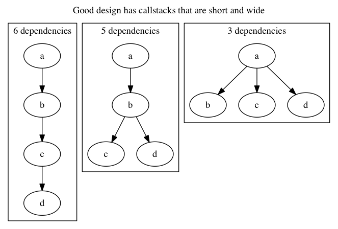

Designing Code
==============

**Well designed code** is code that pushes integration earlier in the callstack.

**Integration** is the joining of two things.

**The callstack** is the set of locations in code that we will return to when finished with the currently running code.

Imagine a callstack where method `a` calls method `b`, which calls method `c`, which calls method `d`.
Applying this idea, we would have `b` integrate `c` and `d`. But if we pushed the integration of these two ideas
earlier, then we could have `a` integrate the other three.

When one thing can be broken by another, we say it **depends on** that thing.
So here, `a` always depends on `a`, `b`, and `c`. But if we have `b` integrate `c` and `d`, then `c` loses its dependency.
If we push the integration earlier, then `b` loses its two dependencies, as well.



This is makes code well designed, because it reduces the number of dependencies.
With few dependencies, you can compose the pieces to do new things that you didn't
initially anticipate. When requirements change, the change is easy to accomodate,
because you are protected from the changing assumptions.


Single Responsibility Principle (SRP)
-------------------------------------


Open Closed Principle (OCP)
---------------------------

> "software entities (classes, modules, functions, etc.) should be open for extension, but closed for modification";[1] that is, such an entity can allow its behaviour to be extended without modifying its source code.
-- [wikipedia](https://en.wikipedia.org/wiki/Open/closed_principle)

This usually takes the form of a big if statement / case statement,
where you will need to modify its code to add branches, when you
want to work for other similar cases.

For example, in tic tac toe, you might have an if statement to see
whether the player is human or a computer. Maybe your computer just
takes random moves, and you want to add another computer that plays
intelligently. You're going to have to go to wherever the source is
and add an additional case.

```ruby
# this code must be modified to extend its functionality
def make_move(player_type)
  if player_type == :human
    move = get_human_move()
  elsif player_type == :random_ai
    move = get_random_move()
  elsif player_type == :intelligent_ai
    move = get_intelligent_move()
  end
  make_move(move)
end
```

In terms of my design guideline, the different player types are all
coupled together, thus the code cannot be used without considering
the other player types.

The guideline is to push the integration point earlier, so rather than having
an if statement everywhere we need to deal with the player, we'll
create a class for each type of player

```ruby
# this code allows you to extend its functionality by creating a new type of player
def make_move(player)
  make_move(player.get_move)
end

class HumanPlayer
  def get_move
    # ...
  end
end

class RandomAi
  def get_move
    # ...
  end
end

class IntelligentAi
  def get_move
    # ...
  end
end

make_move(HumanPlayer.new)
```

### Practice

* Try this out on the Gilded Rose kata.


Interface Segregation Principle (ISP)
-------------------------------------

Small Surface Area

The tinier the better, hence a function is best


Dependency Inversion Principle (DIP)
------------------------------------

Usually implemented through "dependency injection"
Push a dep earlier in the callstack to its parent.


Dependency removal principle
----------------------------

This one I made up, I like it better than DIP.

String > Socket
name > owner (https://github.com/rails/rails/blob/dda31d59a03adb7e5aa372e72bb66a3886632f2f/activerecord/lib/active_record/connection_adapters/abstract/connection_pool.rb#L824-#L953)
implies:
  Data Structures > Objects
    ie run a migration against a second DB
  Integrate early in the callstack

I don't want your baggage, just give me what I need to do my job, not the whole fkn world.


Null Objects
------------

When you have some object that might be nil, you may need to check to see if it is nil
before you call any methods on it. This can take a fairly simple idea and make it complex,
as well as create a lot of test cases you need to hit.

```ruby
class Node
  def initialize(data, link)
    @data, @link = data, link
  end

  def length
    if @link
      1+@link.length
    else
      1
    end
  end

  def join
    if @link
      @data.to_s + @link.join
    else
      @data.to_s
    end
  end
end

list = Node.new('H', Node.new('e', Node.new('l', Node.new('l', Node.new('o', nil)))))
list.length # => 5
list.join   # => "Hello"
```

We want to move these conditionals out of this object, but if we go any higher, we're
at the toplevel! So, we'll move the decision about the nil-ness up to the top,
(you can see it's already there), but create another object whose job is to encapsulate
the knowledge about what to do when nil. This object will be our "null object".


```ruby
class Node
  def initialize(data, link)
    @data, @link = data, link
  end

  def length
    1+@link.length
  end

  def join
    @data.to_s + @link.join
  end
end

class NullNode
  def length
    0
  end

  def join
    ''
  end
end

list = Node.new('H', Node.new('e', Node.new('l', Node.new('l', Node.new('o', NullNode.new)))))
list.length # => 5
list.join   # => "Hello"
```

Now all the code becomes much easier to read, write and test!


Presenters
----------

refactor logic from a view to use a presenter


Interactor
----------

refactor logic out of the model and into an interactor


Don't Repeat Yourself (DRY)
---------------------------

move something like db name into a given place (eg selfup/rejs)


SRP
---


command/query
-------------

data structs as objects
-----------------------

function objects
----------------

refactor to presenters
----------------------
